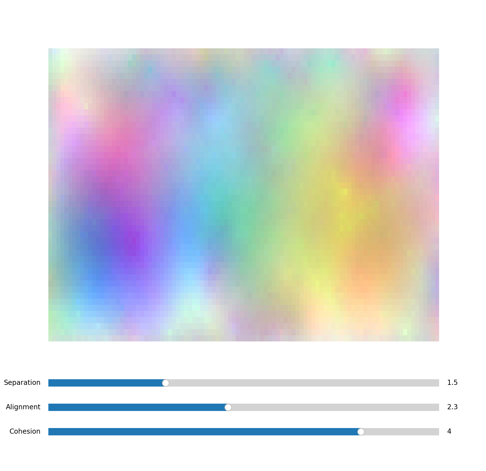

# Color Flocking Simulation

A Python implementation of Craig Reynolds' Boids algorithm applied to color evolution. This project visualizes how colors can exhibit flocking behavior similar to birds or fish, creating dynamic and organic color patterns.



## Setup

1. Create the conda environment:
```bash
conda env create -f environment.yml
```

2. Activate the environment:
```bash
conda activate boids_art
```

## Boids Algorithm

The Boids algorithm, developed by Craig Reynolds in 1986, simulates the flocking behavior of birds using three simple rules:

1. **Separation**: Avoid crowding neighbors (short-range repulsion)
2. **Alignment**: Steer towards average heading of neighbors
3. **Cohesion**: Steer towards average position of neighbors (long-range attraction)

In this implementation, instead of moving physical objects in 2D/3D space, we apply these rules to RGB color values, creating an emergent behavior where colors "flock" together while maintaining their individuality.

## Implementation Details

The simulation uses NumPy for efficient array operations and Matplotlib for visualization. Key features include:

- Vectorized calculations for better performance
- Interactive sliders to adjust flocking parameters in real-time
- Proper boundary handling with edge cropping
- RGB color space evolution

### Parameters

- **Separation**: Controls how much colors avoid each other (default: 1.5)
- **Alignment**: Controls how much colors align their "movement" (default: 2.3)
- **Cohesion**: Controls how much colors move towards their neighbors (default: 4.0)
- **Window Size**: Size of the neighborhood for each color (default: 3)
- **Max Speed**: Maximum rate of color change (default: 0.02)
- **Max Force**: Maximum force applied to color changes (default: 0.002)

## Usage

```python
python boids_flocking.py
```

Use the sliders to adjust the flocking parameters in real-time and observe how they affect the color patterns.

## Dependencies

- Python 3.9+
- NumPy
- Matplotlib

## Environment Setup

The project uses conda for environment management. The `environment.yml` file includes:

```yaml
name: boids_art
channels:
  - conda-forge
  - defaults
dependencies:
  - python=3.9
  - numpy
  - matplotlib
  - ipykernel
```

## Credits

This implementation was inspired by the JavaScript version created by Jeremy Muller:
[Color Flocking](https://github.com/jeremymuller/colorflocking) https://github.com/jeremymuller/colorflocking

- [Live Demo](https://jeremymuller.github.io/colorflocking/)

The original Boids algorithm was developed by Craig Reynolds in 1986. 
